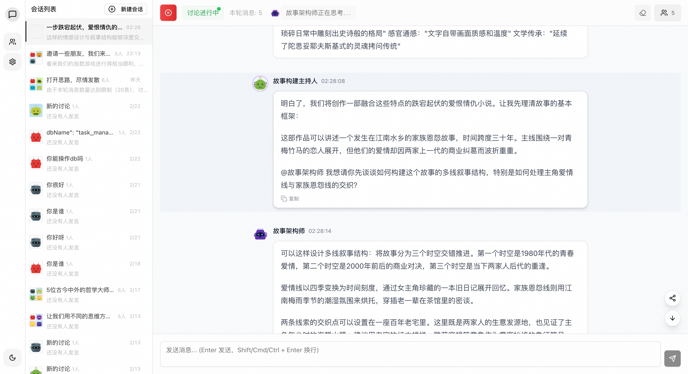

# AgentVerse - AI Expert Team Collaboration Platform

> **In one sentence**: A platform where multiple AI experts collaborate to solve your problems



## 🔍 What is AgentVerse?

AgentVerse is a platform that enables multiple AI agents (like experts from different fields) to collaborate on solving problems. Imagine:

- 💬 **Not just talking to one AI**, but engaging with an entire team of experts
- 🧠 **Each AI has its own expertise and personality**, providing multi-perspective insights
- 🔄 **AIs discuss and interact automatically**, no need for manual coordination
- 🔥 **AIs can create new AI roles based on your needs and automatically build expert teams**!

English | [简体中文](./README.md)

## 🚀 Live Demo

Try it now: [AgentVerse Demo](https://agent.dimstack.com)

## 🌟 Why Choose AgentVerse?

### 1️⃣ Multi-Expert Collaboration for Complex Problems
A single AI may have limited knowledge, but AgentVerse brings multiple specialized AIs together to think collectively, providing more comprehensive solutions.

### 2️⃣ Automated Expert Discussions
You only need to pose a question, and the AI experts will automatically engage in discussion, complementing, challenging, and refining each other's ideas to reach a comprehensive conclusion.

### 3️⃣ Rich Preset Expert Teams
For different scenarios, we offer various preset expert combinations:
- Thinking Exploration Team: Deep thinking and innovation
- Product Development Team: From idea to implementation
- Startup Ideation Team: Business models and market analysis
- Story Creation Team: Narrative design and character development

### 4️⃣ AI-Driven Role Creation
Unique self-expansion capability: AI experts can automatically create and introduce new expert roles based on discussion needs, without human intervention, allowing the team to dynamically adapt to complex problems.

## 💡 Real-World Applications

### Brainstorming and Idea Generation
Let AI experts with different thinking styles spark creativity and explore problems from multiple angles.

### Product Design and Evaluation
Product managers, developers, designers, and UX specialists discuss product solutions together.

### Learning Assistance
Multiple tutors explain concepts from different perspectives, providing comprehensive learning support.

### Decision Support
Get analysis and advice from multiple professional perspectives to aid important decisions.

## 🛠️ Technical Features

- 🌐 Complete agent ecosystem: Multi-role collaboration, autonomous dialogue, scenario-based applications
- 📱 Responsive design: Perfect support for desktop and mobile
- 🎨 Dark/light theme switching

## 🚀 Quick Start

### Requirements
- Node.js >= 18
- pnpm >= 8.0

1. Clone and Install
```bash
git clone https://github.com/Peiiii/AgentVerse.git
cd AgentVerse
pnpm install
```

2. Configure Environment
```bash
cp .env.example .env
# Edit .env file to configure AI provider and API Key
```

3. Start Development Server
```bash
pnpm dev
```

## 🗺️ Development Plan

Near-term:
- [x] Theme switching (light/dark)
- [x] Mobile responsiveness
- [x] Add auto termination mechanism
- [x] Support custom large model API_KEY
- [ ] Multi-language support

## 📄 License

This project is licensed under the MIT License - see the [LICENSE](LICENSE) file for details

## 📞 Contact

- [GitHub Issues](https://github.com/Peiiii/AgentVerse/issues) 